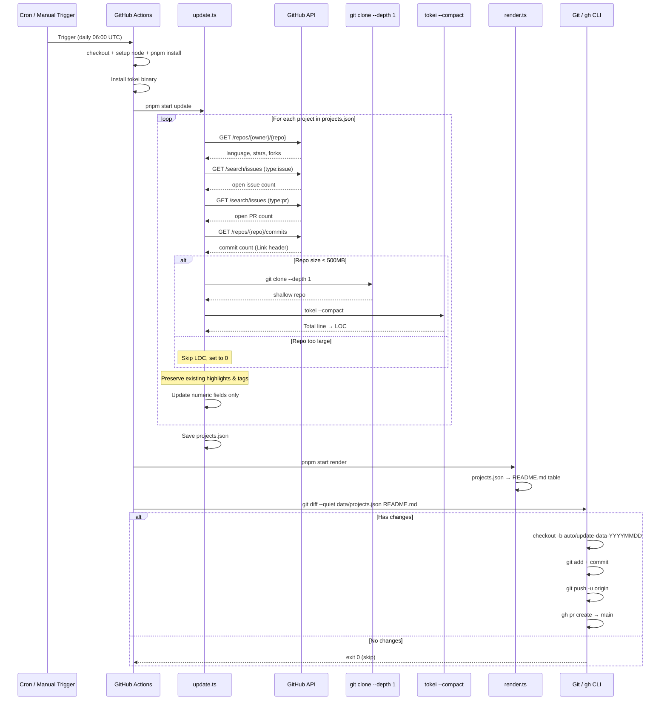
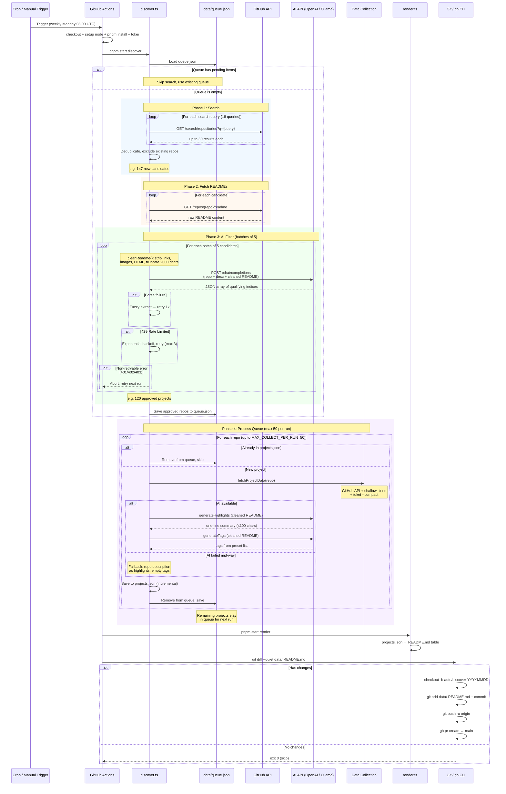
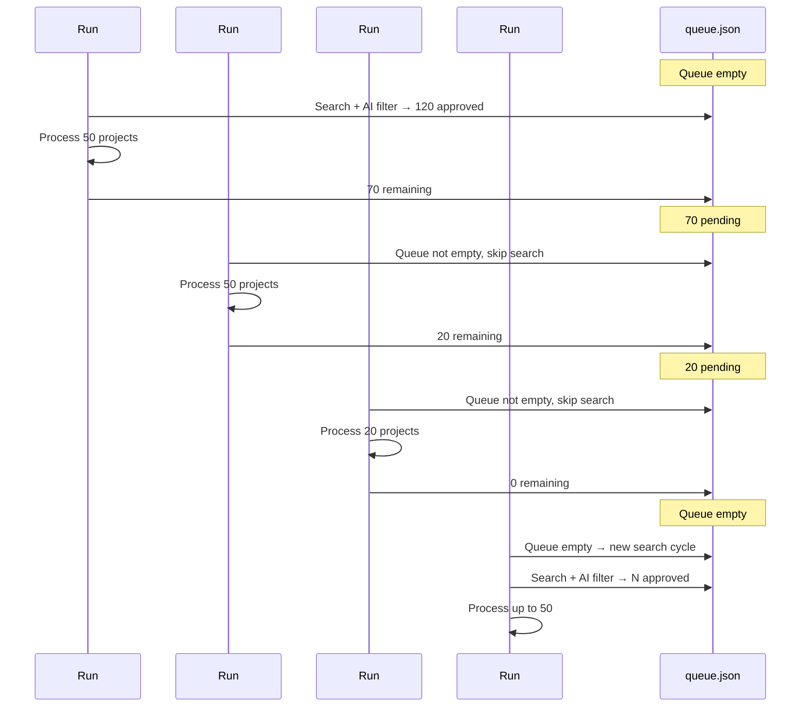

# Workflow Sequence Diagrams

## Update Data Workflow

```mermaid
sequenceDiagram
    participant Cron as Cron / Manual Trigger
    participant GHA as GitHub Actions
    participant Script as update.ts
    participant GH_API as GitHub API
    participant Clone as git clone --depth 1
    participant Tokei as tokei --compact
    participant Render as render.ts
    participant Git as Git / gh CLI

    Cron->>GHA: Trigger (daily 06:00 UTC)
    GHA->>GHA: checkout + setup node + pnpm install
    GHA->>GHA: Install tokei binary

    GHA->>Script: pnpm start update

    loop For each project in projects.json
        Script->>GH_API: GET /repos/{owner}/{repo}
        GH_API-->>Script: language, stars, forks

        Script->>GH_API: GET /search/issues (type:issue)
        GH_API-->>Script: open issue count

        Script->>GH_API: GET /search/issues (type:pr)
        GH_API-->>Script: open PR count

        Script->>GH_API: GET /repos/{repo}/commits
        GH_API-->>Script: commit count (Link header)

        alt Repo size ≤ 500MB
            Script->>Clone: git clone --depth 1
            Clone-->>Script: shallow repo
            Script->>Tokei: tokei --compact
            Tokei-->>Script: Total line → LOC
        else Repo too large
            Note over Script: Skip LOC, set to 0
        end

        Note over Script: Preserve existing highlights & tags
        Script->>Script: Update numeric fields only
    end

    Script->>Script: Save projects.json

    GHA->>Render: pnpm start render
    Render->>Render: projects.json → README.md table

    GHA->>Git: git diff --quiet data/projects.json README.md
    alt Has changes
        Git->>Git: checkout -b auto/update-data-YYYYMMDD
        Git->>Git: git add + commit
        Git->>Git: git push -u origin
        Git->>Git: gh pr create → main
    else No changes
        Git-->>GHA: exit 0 (skip)
    end
```

## Discover Workflow

```mermaid
sequenceDiagram
    participant Cron as Cron / Manual Trigger
    participant GHA as GitHub Actions
    participant Disc as discover.ts
    participant Queue as data/queue.json
    participant GH_API as GitHub API
    participant AI as AI API (OpenAI / Ollama)
    participant Collect as Data Collection
    participant Render as render.ts
    participant Git as Git / gh CLI

    Cron->>GHA: Trigger (weekly Monday 08:00 UTC)
    GHA->>GHA: checkout + setup node + pnpm install + tokei

    GHA->>Disc: pnpm start discover

    Disc->>Queue: Load queue.json

    alt Queue has pending items
        Note over Disc,Queue: Skip search, use existing queue
    else Queue is empty

        rect rgb(240, 248, 255)
            Note over Disc,GH_API: Phase 1: Search
            loop For each search query (18 queries)
                Disc->>GH_API: GET /search/repositories?q={query}
                GH_API-->>Disc: up to 30 results each
            end
            Disc->>Disc: Deduplicate, exclude existing repos
            Note over Disc: e.g. 147 new candidates
        end

        rect rgb(255, 248, 240)
            Note over Disc,GH_API: Phase 2: Fetch READMEs
            loop For each candidate
                Disc->>GH_API: GET /repos/{repo}/readme
                GH_API-->>Disc: raw README content
            end
        end

        rect rgb(240, 255, 240)
            Note over Disc,AI: Phase 3: AI Filter (batches of 5)
            loop For each batch of 5 candidates
                Note over Disc: cleanReadme(): strip links,<br/>images, HTML, truncate 2000 chars
                Disc->>AI: POST /chat/completions<br/>(repo + desc + cleaned README)
                AI-->>Disc: JSON array of qualifying indices

                alt Parse failure
                    Disc->>Disc: Fuzzy extract → retry 1x
                end
                alt 429 Rate Limited
                    Disc->>Disc: Exponential backoff, retry (max 3)
                end
                alt Non-retryable error (401/402/403)
                    Disc-->>GHA: Abort, retry next run
                end
            end
            Note over Disc: e.g. 120 approved projects
        end

        Disc->>Queue: Save approved repos to queue.json

    end

    rect rgb(248, 240, 255)
        Note over Disc,Collect: Phase 4: Process Queue (max 50 per run)
        loop For each repo (up to MAX_COLLECT_PER_RUN=50)
            alt Already in projects.json
                Disc->>Queue: Remove from queue, skip
            else New project
                Disc->>Collect: fetchProjectData(repo)
                Note over Collect: GitHub API + shallow clone<br/>+ tokei --compact

                alt AI available
                    Disc->>AI: generateHighlights (cleaned README)
                    AI-->>Disc: one-line summary (≤100 chars)
                    Disc->>AI: generateTags (cleaned README)
                    AI-->>Disc: tags from preset list
                else AI failed mid-way
                    Note over Disc: Fallback: repo description<br/>as highlights, empty tags
                end

                Disc->>Disc: Save to projects.json (incremental)
                Disc->>Queue: Remove from queue, save
            end
        end
        Note over Queue: Remaining projects stay<br/>in queue for next run
    end

    GHA->>Render: pnpm start render
    Render->>Render: projects.json → README.md table

    GHA->>Git: git diff --quiet data/ README.md
    alt Has changes
        Git->>Git: checkout -b auto/discover-YYYYMMDD
        Git->>Git: git add data/ README.md + commit
        Git->>Git: git push -u origin
        Git->>Git: gh pr create → main
    else No changes
        Git-->>GHA: exit 0 (skip)
    end
```

## Multi-Run Queue Processing

```mermaid
sequenceDiagram
    participant Run1 as Run #1
    participant Run2 as Run #2
    participant Run3 as Run #3
    participant Run4 as Run #4
    participant Queue as queue.json

    Note over Queue: Queue empty

    Run1->>Queue: Search + AI filter → 120 approved
    Run1->>Run1: Process 50 projects
    Run1->>Queue: 70 remaining

    Note over Queue: 70 pending

    Run2->>Queue: Queue not empty, skip search
    Run2->>Run2: Process 50 projects
    Run2->>Queue: 20 remaining

    Note over Queue: 20 pending

    Run3->>Queue: Queue not empty, skip search
    Run3->>Run3: Process 20 projects
    Run3->>Queue: 0 remaining

    Note over Queue: Queue empty

    Run4->>Queue: Queue empty → new search cycle
    Run4->>Queue: Search + AI filter → N approved
    Run4->>Run4: Process up to 50
```
