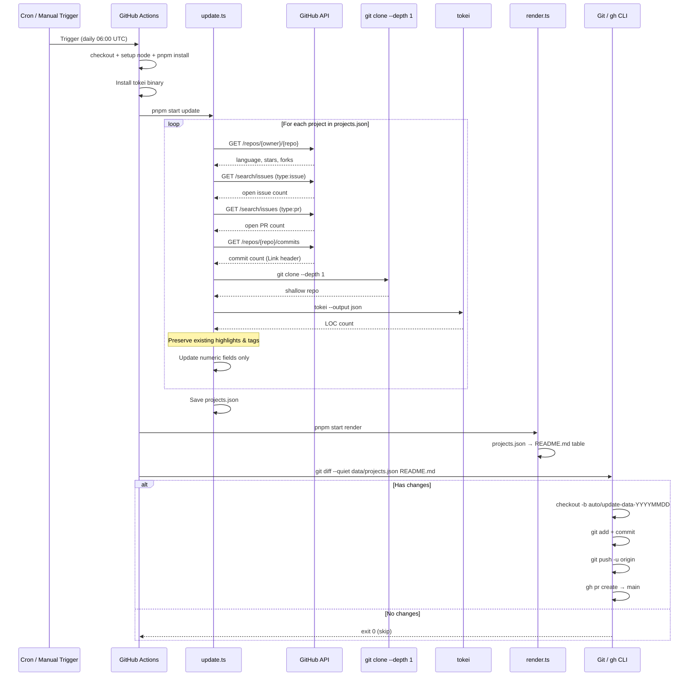
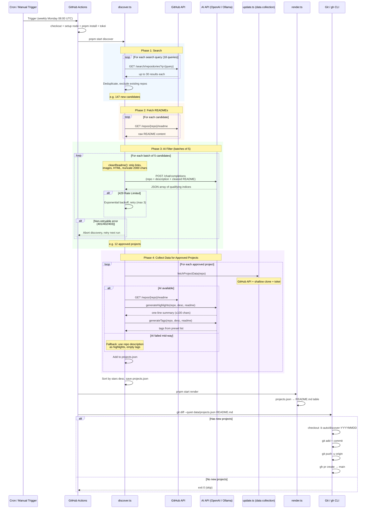

# Workflow Sequence Diagrams

## Update Data Workflow

```mermaid
sequenceDiagram
    participant Cron as Cron / Manual Trigger
    participant GHA as GitHub Actions
    participant Script as update.ts
    participant GH_API as GitHub API
    participant Clone as git clone --depth 1
    participant Tokei as tokei
    participant Render as render.ts
    participant Git as Git / gh CLI

    Cron->>GHA: Trigger (daily 06:00 UTC)
    GHA->>GHA: checkout + setup node + pnpm install
    GHA->>GHA: Install tokei binary

    GHA->>Script: pnpm start update

    loop For each project in projects.json
        Script->>GH_API: GET /repos/{owner}/{repo}
        GH_API-->>Script: language, stars, forks

        Script->>GH_API: GET /search/issues (type:issue)
        GH_API-->>Script: open issue count

        Script->>GH_API: GET /search/issues (type:pr)
        GH_API-->>Script: open PR count

        Script->>GH_API: GET /repos/{repo}/commits
        GH_API-->>Script: commit count (Link header)

        Script->>Clone: git clone --depth 1
        Clone-->>Script: shallow repo
        Script->>Tokei: tokei --output json
        Tokei-->>Script: LOC count

        Note over Script: Preserve existing highlights & tags
        Script->>Script: Update numeric fields only
    end

    Script->>Script: Save projects.json

    GHA->>Render: pnpm start render
    Render->>Render: projects.json → README.md table

    GHA->>Git: git diff --quiet data/projects.json README.md
    alt Has changes
        Git->>Git: checkout -b auto/update-data-YYYYMMDD
        Git->>Git: git add + commit
        Git->>Git: git push -u origin
        Git->>Git: gh pr create → main
    else No changes
        Git-->>GHA: exit 0 (skip)
    end
```

## Discover Workflow

```mermaid
sequenceDiagram
    participant Cron as Cron / Manual Trigger
    participant GHA as GitHub Actions
    participant Disc as discover.ts
    participant GH_API as GitHub API
    participant AI as AI API (OpenAI / Ollama)
    participant Update as update.ts (data collection)
    participant Render as render.ts
    participant Git as Git / gh CLI

    Cron->>GHA: Trigger (weekly Monday 08:00 UTC)
    GHA->>GHA: checkout + setup node + pnpm install + tokei

    GHA->>Disc: pnpm start discover

    rect rgb(240, 248, 255)
        Note over Disc,GH_API: Phase 1: Search
        loop For each search query (18 queries)
            Disc->>GH_API: GET /search/repositories?q={query}
            GH_API-->>Disc: up to 30 results each
        end
        Disc->>Disc: Deduplicate, exclude existing repos
        Note over Disc: e.g. 147 new candidates
    end

    rect rgb(255, 248, 240)
        Note over Disc,GH_API: Phase 2: Fetch READMEs
        loop For each candidate
            Disc->>GH_API: GET /repos/{repo}/readme
            GH_API-->>Disc: raw README content
        end
    end

    rect rgb(240, 255, 240)
        Note over Disc,AI: Phase 3: AI Filter (batches of 5)
        loop For each batch of 5 candidates
            Note over Disc: cleanReadme(): strip links,<br/>images, HTML, truncate 2000 chars
            Disc->>AI: POST /chat/completions<br/>(repo + description + cleaned README)
            AI-->>Disc: JSON array of qualifying indices

            alt 429 Rate Limited
                Disc->>Disc: Exponential backoff, retry (max 3)
            end
            alt Non-retryable error (401/402/403)
                Disc-->>GHA: Abort discovery, retry next run
            end
        end
        Note over Disc: e.g. 12 approved projects
    end

    rect rgb(248, 240, 255)
        Note over Disc,AI: Phase 4: Collect Data for Approved Projects
        loop For each approved project
            Disc->>Update: fetchProjectData(repo)
            Note over Update: GitHub API + shallow clone + tokei

            alt AI available
                Disc->>GH_API: GET /repos/{repo}/readme
                Disc->>AI: generateHighlights(repo, desc, readme)
                AI-->>Disc: one-line summary (≤100 chars)
                Disc->>AI: generateTags(repo, desc, readme)
                AI-->>Disc: tags from preset list
            else AI failed mid-way
                Note over Disc: Fallback: use repo description<br/>as highlights, empty tags
            end

            Disc->>Disc: Add to projects.json
        end
    end

    Disc->>Disc: Sort by stars desc, save projects.json

    GHA->>Render: pnpm start render
    Render->>Render: projects.json → README.md table

    GHA->>Git: git diff --quiet data/projects.json README.md
    alt Has new projects
        Git->>Git: checkout -b auto/discover-YYYYMMDD
        Git->>Git: git add + commit
        Git->>Git: git push -u origin
        Git->>Git: gh pr create → main
    else No new projects
        Git-->>GHA: exit 0 (skip)
    end
```
